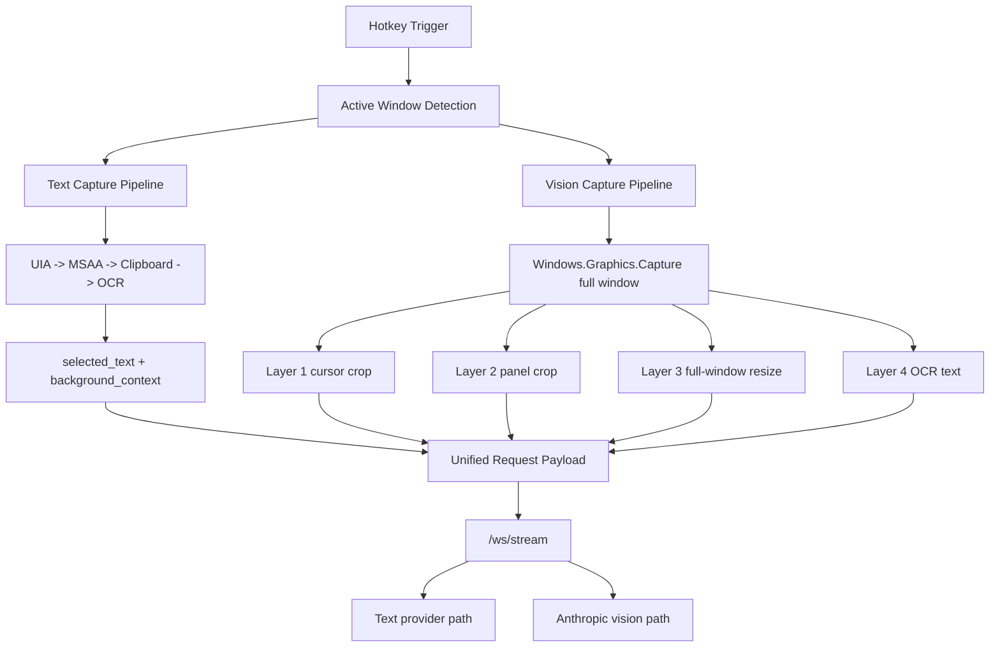

# Capture Architecture Pipeline

This document is the technical reference for the current capture architecture. The deployment, auth, feedback, and packaging work does not replace this capture design.

## Core Principle

The capture pipeline remains Windows-native and performance-first.

The surrounding work added around auth, logging, and deployment does not redesign the core capture path:

- no Web frontend replacement
- no Electron migration
- no browser-based capture conversion
- no blocking DB writes before first token
- no prompt or logging work inside the capture extraction path itself

## Core Technologies

- **Win32 APIs:** foreground/window detection and focus handling
- **UI Automation (UIA):** primary selected/background extraction path
- **MSAA / IAccessible:** secondary fallback path
- **Clipboard Compatibility Mode:** safe copy-based fallback for editors and terminal cases
- **Classic Console Buffer API:** legacy terminal support
- **Native Windows OCR Engine:** last-resort fallback for canvas, blocked, or visual-only surfaces
- **Windows.Graphics.Capture:** full active-window capture for layered vision context
- **Magick.NET:** downsampling and payload shaping for the cursor, panel, and window layers

## Global Pipeline

1. Detect the active window and process.
2. Classify the environment.
3. Route to the matching capture strategy.
4. Run the existing text pipeline and the active-window vision capture path in parallel.
5. Extract selected text using the ordered fallback chain.
6. Extract background context using the strategy-specific fallback chain.
7. Capture cursor, panel, and full-window image layers plus OCR text from the full window.
8. Build one unified payload including methods, partial/unsupported state, usage context, and optional vision layers.
9. Send the final payload to the backend only after capture completes.

## Dual-Path Architecture

## Vision Layer Rules

- **Layer 1:** `400x300` around the cursor for fine-detail UI understanding
- **Layer 2:** nearest UIA panel/group/document/custom/window bounds, with a `1200x800` centered fallback
- **Layer 3:** full active window downsampled to at most `1024x768`
- **Layer 4:** OCR extracted from the full captured window

The backend uses the same payload envelope for:

- `text_only`
- `vision_augmented`
- `vision_only`

## Selected Text Fallback Order

### Generic order

1. UIA selection
2. MSAA explicit selection
3. MSAA focused-text fallback where allowed
4. clipboard compatibility where allowed
5. unsupported selected result

### IDE terminal special order

1. UIA selection
2. MSAA explicit selection
3. terminal-safe clipboard compatibility fallback
4. unsupported selected result

## Background Context Fallback Order

### IDE editor

- UIA visible ranges
- UIA document range
- UIA selection-anchored text range expansion
- nearest UIA container
- MSAA container
- OCR
- metadata fallback

For IDE editors, the pipeline now collects multiple structured candidates first and scores them before accepting a background result. This keeps OCR as the real last resort instead of the common VS Code fallback path.

### Terminal

- UIA visible ranges
- optional UIA document range for modern terminal
- OCR
- metadata fallback

### Browser / Electron

- nearest UIA container
- OCR
- metadata fallback

### Canvas-locked or external surfaces

- OCR-first fallback path

## Safety Rules

### Clipboard safety

- backup clipboard before copy simulation
- send only `Ctrl+C`
- detect clipboard change safely
- restore the original clipboard in `finally`

### Quality filtering

- reject UI junk and metadata noise
- prefer code-like or terminal-like content signals
- preserve partial results when useful selected text is missing but context is still helpful
- sanitize obvious junk characters before data is sent to the backend

## Capture Output Fields

The capture result currently includes fields such as:

- `selected_text`
- `background_context`
- `window_title`
- `process_name`
- `environment_type`
- `selected_method`
- `background_method`
- `is_partial`
- `is_unsupported`
- `status_message`
- `usage_context`

`is_partial` and `is_unsupported` still exist as runtime capture metadata, but they are no longer stored in the hosted request log table.

## Deployment Note

Auth restore, feedback sending, and DB logging happen around the capture system, not inside the capture extraction path itself. This keeps the core capture behavior and latency profile stable.
