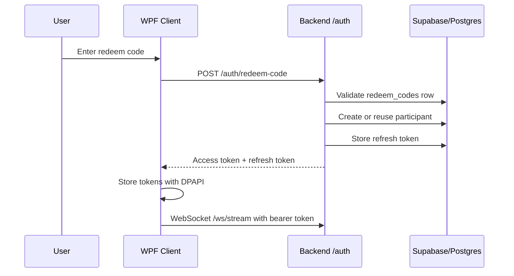
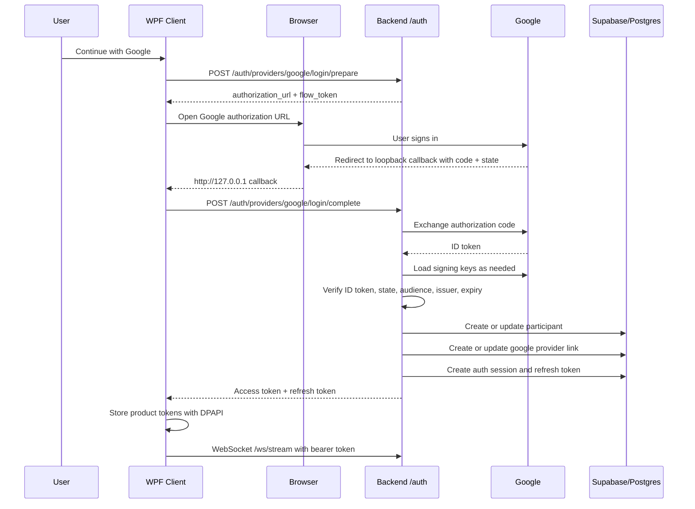

# Google Auth Migration

## 1. Overview and Motivation

This document describes the migration from redeem-code-first authentication to Google OAuth as the primary sign-in path for the Windows desktop client.

The core product behavior must stay unchanged:

- Windows capture, hotkey, overlay, and streaming response flow remain intact.
- The backend keeps the same authenticated WebSocket model.
- The client keeps DPAPI-backed secure token storage through `SecureTokenStore.cs`.
- Access-token refresh, session restore, and logout continue to use the existing `AuthSessionManager` pattern.

The branch currently contains a shared provider foundation rather than a Google-only hard switch. Redeem code, Google, and email/password sign-in are all represented as auth provider links that create the same access-token and refresh-token session shape.

The production migration goal is:

- make Google the preferred default sign-in method;
- preserve redeem-code support long enough for existing pilot users or account linking;
- remove the legacy redeem-code-only mental model from the backend, client UI, docs, and database operations;
- keep the request logging and WebSocket authorization contract stable.

## 2. Google Cloud Console Setup

1. Open Google Cloud Console and select the production project.
2. Configure the OAuth consent screen.
3. Set the app name to the production product name, such as `simpleDocs`.
4. Add the support email and developer contact email.
5. Add the scopes required by this app:
   - `openid`
   - `email`
   - `profile`
6. Create an OAuth client for a desktop or installed-app style flow.
7. Add loopback redirect URIs for the Windows client callback:
   - `http://127.0.0.1:48152/`
   - `http://localhost:48152/` if the Google client type requires explicit localhost registration.
8. Copy the Google client ID.
9. Copy the Google client secret only if the selected OAuth client type issues one and the backend is configured to require it.
10. Keep the consent screen in testing mode until the internal pilot accounts are added and verified.
11. Before wider external rollout, publish or verify the consent screen according to the chosen Google account audience.

If the release should be restricted to one organization, configure `GOOGLE_ALLOWED_EMAIL_DOMAIN` in the backend and test both accepted and rejected accounts.

## 3. New Environment Variables

Backend auth relies on these environment variables:

```text
GOOGLE_CLIENT_ID=<google oauth client id>
GOOGLE_CLIENT_SECRET=<optional google oauth client secret>
GOOGLE_ALLOWED_EMAIL_DOMAIN=<optional allowed email domain>
AUTH_FLOW_TOKEN_SECRET=<strong secret for short-lived browser auth flow tokens>
AUTH_ALLOWED_LOOPBACK_HOSTS=127.0.0.1,localhost
GOOGLE_FLOW_TTL_SECONDS=600
ACCESS_TOKEN_SECRET=<strong jwt signing secret>
ACCESS_TOKEN_TTL=15m
REFRESH_TOKEN_TTL_DAYS=30
SKIP_AUTH=false
```

Existing database and logging settings remain required:

```text
SUPABASE_URL=<hosted supabase url>
SUPABASE_ANON_KEY=<hosted supabase anon key>
SUPABASE_SERVICE_ROLE_KEY=<hosted supabase service role key>
AUTH_PARTICIPANTS_TABLE=participants
AUTH_CODES_TABLE=redeem_codes
AUTH_PROVIDER_LINKS_TABLE=auth_provider_links
AUTH_SESSIONS_TABLE=auth_sessions
AUTH_REFRESH_TOKENS_TABLE=refresh_tokens
REQUEST_LOGS_TABLE=request_logs
```

`AUTH_FLOW_TOKEN_SECRET` can fall back to `ACCESS_TOKEN_SECRET` in the current implementation, but production should use a separate strong secret so browser-flow tokens and access tokens are independently rotatable.

## 4. Backend Changes

### `backend/src/routes/auth.js`

Current route shape:

- `POST /auth/providers/google/login/prepare`
- `POST /auth/providers/google/login/complete`
- `POST /auth/providers/google/link/prepare`
- `POST /auth/providers/google/link/complete`
- `POST /auth/providers/email-password/login`
- `POST /auth/providers/email-password/register`
- `POST /auth/providers/email-password/link`
- `POST /auth/providers/redeem-code/login`
- `POST /auth/providers/redeem-code/link`
- `POST /auth/redeem-code` for legacy compatibility
- `POST /auth/refresh`
- `POST /auth/logout`
- `GET /auth/me`

Migration target:

- keep `refresh`, `logout`, and `me`;
- keep the provider route pattern;
- make Google the default supported production login route;
- keep redeem-code routes only as a temporary pilot compatibility path or account-linking path;
- remove `POST /auth/redeem-code` after all old clients have been retired.

### `backend/src/auth/providers/googleAuthProvider.js`

This is the Google OAuth provider implementation.

It currently:

- creates PKCE state, verifier, challenge, and a short-lived backend-signed flow token;
- builds the Google authorization URL;
- exchanges the authorization code at `https://oauth2.googleapis.com/token`;
- verifies the returned Google ID token with Google JWKS;
- validates issuer, audience, expiry, subject, and optional allowed email domain;
- creates or updates a participant;
- creates or updates the Google provider link;
- supports both login and account linking.

Migration target:

- keep this provider as the primary production provider;
- test expired flow token, invalid state, wrong audience, wrong issuer, and rejected domain paths;
- remove legacy direct PKCE completion only after older client builds are no longer supported.

### `backend/src/auth/providers/redeemCodeAuthProvider.js`

This is the legacy/pilot provider.

It currently:

- normalizes redeem codes;
- loads rows from `redeem_codes`;
- creates a participant if the code is not already tied to one;
- creates a `redeem_code` provider link;
- marks the code as used;
- supports account linking.

Migration target:

- keep only for migration or pilot fallback while existing testers still depend on it;
- stop issuing new redeem codes once Google is the required sign-in method;
- remove the route, provider, seed file, and `redeem_codes` table after all accounts have Google provider links.

### `backend/src/auth/authService.js`

This is the provider orchestration layer.

It currently:

- turns each provider result into one common session response;
- starts an authenticated session through `startAuthenticatedSession`;
- returns access and refresh tokens;
- returns current user and linked methods;
- supports login, registration, linking, refresh, logout, and current auth state.

Migration target:

- keep this shared abstraction;
- stop treating redeem code as the conceptual default;
- ensure user summaries are driven by `participants` plus `auth_provider_links`, not provider-specific participant columns.

### `backend/src/auth/sessionService.js` and `backend/src/auth/tokenService.js`

These stay.

They provide the stable session and JWT contract consumed by:

- `backend/src/middleware/auth.js`;
- WebSocket authentication;
- feedback routes;
- request logging.

Migration target:

- keep JWT payload fields such as `participant_id`, `session_id`, `provider_link_id`, and `auth_provider`;
- keep refresh-token rotation and revocation behavior;
- do not change WebSocket auth unless a future release intentionally changes token semantics.

### `backend/src/middleware/auth.js`

Keep this middleware.

The migration changes which provider feeds the token, not how protected routes and WebSockets validate bearer tokens.

### `backend/src/services/authService.js`

This older service name still appears in the plan as a legacy path. In the current branch, the active shared auth implementation is under `backend/src/auth/`, and `backend/src/services/authService.js` remains in the backend syntax check list only if still present in older snapshots.

Migration target:

- verify there is no duplicate active auth logic;
- retire stale service-layer auth code if it no longer participates in the route path.

## 5. Client Changes

### `client\AuthApiClient.cs`

Current client API surface:

- `RedeemCodeAsync`
- `PrepareGoogleLoginAsync`
- `CompleteGoogleLoginAsync`
- `LoginWithEmailPasswordAsync`
- `RegisterWithEmailPasswordAsync`
- `PrepareGoogleLinkAsync`
- `CompleteGoogleLinkAsync`
- `LinkRedeemCodeAsync`
- `LinkEmailPasswordAsync`
- `GetCurrentAuthStateAsync`
- `RefreshAsync`
- `LogoutAsync`

Migration target:

- keep Google login and Google linking;
- keep refresh, logout, and current-auth-state calls;
- remove or hide redeem-code login when all pilot users have migrated;
- keep redeem-code linking only if support wants a controlled fallback path;
- ensure all production builds point to hosted backend auth routes.

### `client\AuthSessionManager.cs`

This class should stay as the session owner.

It currently:

- restores secure local sessions;
- refreshes access tokens before expiry;
- persists access and refresh tokens through `SecureTokenStore`;
- signs in with redeem code, Google, or email/password;
- links Google, redeem code, or email/password to the current account;
- logs out locally and revokes the refresh token best-effort on the backend.

Migration target:

- keep `TryRestoreSessionAsync`, `EnsureValidAccessTokenAsync`, and `LogoutAsync`;
- make `SignInWithGoogleAsync` the preferred first-run path;
- remove or hide `RedeemCodeAsync` when migration is complete.

### `client\BrowserAuthCoordinator.cs`

This class stays.

It currently:

- starts a loopback HTTP listener;
- opens the system browser;
- receives the Google authorization callback;
- returns the authorization code and state to the desktop app;
- shows a browser success/failure message.

Migration target:

- keep the loopback callback port aligned with Google Console and backend config;
- test listener startup failures, timeout, user cancellation, and successful callback.

### `client\LoginWindow.xaml` and `client\LoginWindow.xaml.cs`

Current UI exposes tabs for:

- redeem code;
- Google;
- email/password.

Migration target:

- make Google the first/default tab for production Google-first rollout;
- move redeem code behind a secondary or support-only action;
- keep error handling concise for the desktop overlay app audience;
- avoid changing capture/overlay UX while finishing auth migration.

### `client\SecureTokenStore.cs`

Keep this file.

The storage mechanism is reusable because the app stores product-issued access and refresh tokens after Google completes, not raw Google credentials.

## 6. Database Schema Changes

### Current shared model

The current provider foundation uses:

- `participants`
- `auth_provider_links`
- `auth_sessions`
- `refresh_tokens`
- `request_logs`
- `redeem_codes` during the compatibility window

`participants` stores shared user profile fields:

- `email`
- `email_verified`
- `display_name`
- `given_name`
- `family_name`
- `avatar_url`
- `last_authenticated_at`

`auth_provider_links` stores provider-specific identities:

- `provider_type`: `redeem_code`, `google`, or `password`
- `provider_subject`
- `provider_email`
- `profile_json`
- `metadata_json`
- `password_hash` and `password_algorithm` only for password provider rows
- `is_enabled`
- `linked_at`
- `last_authenticated_at`
- `last_verified_at`

`auth_sessions` stores login sessions created by any provider.

`refresh_tokens` remains the durable refresh-token table and links to sessions/provider links.

### Migration SQL already represented

- `004_google_auth_participants.sql` adds early Google fields to `participants`.
- `005_unified_auth_foundation.sql` creates the shared provider/session model, migrates existing Google/redeem-code data into `auth_provider_links`, backfills `auth_sessions`, and drops old `participants.auth_provider` and `participants.google_sub` columns.

### Final Google-first cleanup

After every active user has a Google provider link and old builds are retired:

1. Stop issuing rows in `redeem_codes`.
2. Remove redeem-code login from the client.
3. Remove `POST /auth/redeem-code`.
4. Remove `POST /auth/providers/redeem-code/login`.
5. Decide whether `POST /auth/providers/redeem-code/link` is still needed for support.
6. Archive or drop `redeem_codes` only after confirming no production workflows depend on it.
7. Remove seed files and checklist items that still require redeem-code provisioning.

Do not drop `request_logs` fields or auth/session tables as part of this migration. Logging and feedback are separate product telemetry concerns.

## 7. Auth Flow Diagram

### Before



### After



## 8. Migration Path for Existing Participants

1. Apply the unified auth migration in hosted Supabase.
2. Confirm `auth_provider_links` exists and contains migrated `redeem_code` rows.
3. Confirm any existing Google participant fields were migrated into `auth_provider_links` rows with `provider_type = 'google'`.
4. Keep redeem-code sign-in enabled during the first pilot migration window.
5. Ask existing redeem-code users to sign in, open account methods, and link Google.
6. Confirm each migrated user has:
   - one `participants` row;
   - one `auth_provider_links` row for `redeem_code`;
   - one `auth_provider_links` row for `google`;
   - one active or recent `auth_sessions` row;
   - one active `refresh_tokens` row for the current desktop session.
7. Move production UI to Google-first after support has a fallback process.
8. Stop issuing new redeem codes.
9. Remove redeem-code login from packaged builds after all active pilot users have a Google link.
10. Retire redeem-code database operations after old packages are out of circulation.

Conflict handling:

- If Google email matches an existing participant but no Google provider link exists, the backend should require signing in with an existing method first and then linking Google.
- If a Google subject is already linked to another participant, the backend should reject the link.
- If a redeem code already belongs to another participant, the backend should reject the link.

## 9. Testing Checklist

### Backend checks

- `npm run check` passes in `backend`.
- `npm run check:db` reaches hosted DB tables.
- `POST /auth/providers/google/login/prepare` returns an authorization URL and flow token.
- `POST /auth/providers/google/login/complete` succeeds for a valid Google callback.
- Invalid state is rejected.
- Expired flow token is rejected.
- Wrong Google audience is rejected.
- Optional domain restriction rejects out-of-domain accounts.
- Existing Google provider link logs into the same participant.
- Email collision without prior linking returns a clear conflict.
- `POST /auth/refresh` returns a valid access token.
- `POST /auth/logout` revokes the refresh-token session.
- Authenticated `GET /auth/me` returns user plus linked methods.

### Client checks

- First-run Google sign-in opens the browser.
- Loopback callback returns to the desktop app.
- Tokens are stored through `SecureTokenStore`.
- Restart restores the session without showing login.
- Token refresh works after the access token expires.
- Logout clears local state and revokes backend refresh token best-effort.
- Account methods screen can link Google for an existing redeem-code user.
- Redeem-code tab is hidden, demoted, or retained only according to the release decision.

### Product flow checks

- Authenticated WebSocket connect succeeds after Google sign-in.
- One full explain request streams into the overlay.
- Request logging writes one final `request_logs` row.
- Feedback updates `request_logs.feedback_reaction`.
- Capture and overlay behavior are unchanged from the pre-migration build.

### Package checks

- Production config points to hosted backend URLs.
- `SKIP_AUTH=false`.
- Google env vars are configured on Azure before the package is given to testers.
- Clean-machine launch completes.
- Google sign-in succeeds on a non-development Windows machine.
- Support runbook includes the Google sign-in failure path.

### Cleanup checks

- No secrets are committed.
- Redeem-code seed files are no longer used for Google-first users.
- Release checklist no longer requires redeem-code validation once the route is retired.
- Documentation says Google is the primary method after the production cutover.
