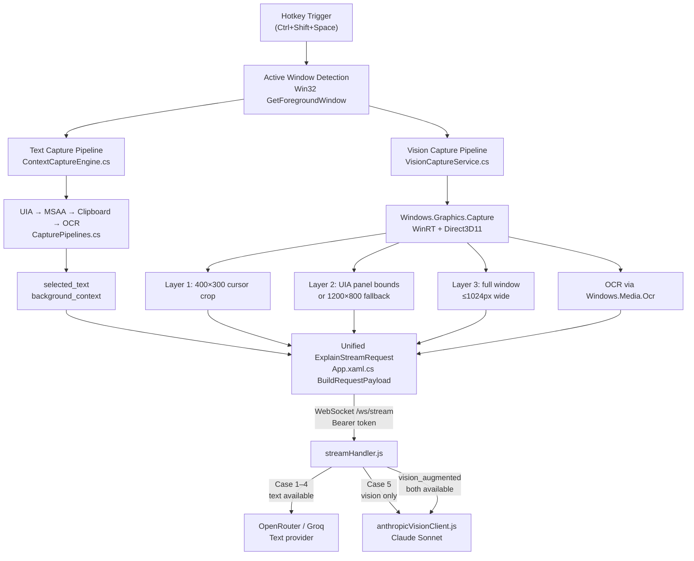

# Vision-Augmented Capture Pipeline — Development Plan

## Context

simpleDocs uses a Windows-native capture pipeline (UIA → MSAA → Clipboard → OCR) that works
in IDEs, browsers, and terminals where text is exposed via accessibility APIs. It fails for
canvas-locked applications — Google Docs, Figma, DaVinci Resolve, Premiere Pro, image/PDF
viewers — where content is rendered as pixels rather than accessible text.

This document tracks the Vision-Augmented System-Wide Capture Pipeline that fixes this gap:
parallel multi-region screen capture sent alongside the existing text result to a Vision
Language Model (Claude Sonnet) that can describe what it sees.

Related documents:
- [CAPTURE_PIPELINE.md](CAPTURE_PIPELINE.md) — canonical dual-path architecture reference
- [GOOGLE_AUTH_MIGRATION.md](GOOGLE_AUTH_MIGRATION.md) — auth migration (separate concern)
- [implementation_plan.md](implementation_plan.md) — overall pilot readiness tracker

---

## Architecture — Dual-Path Flow



---

## Implementation Status

### Part A — Adaptive Multi-Region Capture Service (C# Client)

| Component | File | Status | Notes |
|-----------|------|--------|-------|
| Interface | `client/ContextCapture/Vision/IVisionCaptureService.cs` | DONE | Matches spec exactly |
| Enum | `client/ContextCapture/Vision/CaptureMode.cs` | DONE | 5 modes incl. AllLayers |
| Result model | `client/ContextCapture/Vision/VisionCaptureResult.cs` | DONE | HasAnyImage, TotalImageBytes |
| Implementation | `client/ContextCapture/Vision/VisionCaptureService.cs` | DONE | See detail below |
| Debug exporter | `client/ContextCapture/Vision/VisionDebugExporter.cs` | DONE | Saves layer PNGs for inspection |

`VisionCaptureService.cs` implementation detail:
- Uses **Windows.Graphics.Capture (WinRT) + Vortice.Direct3D11** — no GDI BitBlt
- Captures cursor region (400×300), active panel (UIA bounds or 1200×800 fallback), full window (≤1024px)
- UIA tree walk: `AutomationElement.FromPoint` → walks up to 12 ancestor levels, matches Pane / Group / Document / Custom / Window control types, validates bounds (between 400×300 and 80% of screen)
- Parallel: all three captures + OCR run via `Task.WhenAll`
- Image encoding via **Magick.NET-Q8-AnyCPU** (already in `.csproj`): PNG8, quality 80, targets cursor <50 KB, panel <200 KB, window <400 KB
- OCR via `Windows.Media.Ocr`

### Part B — Capture Orchestration Layer (C# Client)

| Component | File | Status | Notes |
|-----------|------|--------|-------|
| Parallel task exec | `client/App.xaml.cs` L265–269 | DONE | `Task.WhenAll` text + vision |
| Feature flag | `client/App.xaml.cs` L365 | DONE | `EnableVisionPipeline` config check |
| Vision wrapper | `client/App.xaml.cs` `TryCaptureVisionAsync` | DONE | Try/catch, logs failure |
| Request builder | `client/App.xaml.cs` L383–430 | DONE | Sets captureMethodExtended: vision_augmented / vision_only / text_only |
| Payload model | `client/ExplainStreamRequest.cs` L23 | DONE | `Vision` property typed `VisionCaptureResult?` |
| Serialization | `client/BackendClient.cs` L81–88 | DONE | Base64 encodes PNGs, sends vision object |

Decision logic (verified in code):
- Always includes vision payload when `EnableVisionPipeline = true`
- If text path returned high-confidence selected text → `vision_augmented`
- If text path failed → `vision_only`
- If vision disabled or failed → `text_only`
- Timeout budget: 800 ms total for combined capture

### Part C — Backend Vision Routing (Node.js / Hono)

| Component | File | Status | Notes |
|-----------|------|--------|-------|
| WS handler | `backend/src/app.js` L32–57 | DONE | Accepts new vision fields alongside existing fields |
| Vision normalizer | `backend/src/services/streamHandler.js` L86–106 | DONE | Accepts snake_case + camelCase, null-safe |
| PNG dimension reader | `backend/src/services/streamHandler.js` L120–141 | DONE | Reads header bytes for cost estimate |
| Classifier Case 5 | `backend/src/services/classifier.js` | DONE | vision-only when no text + ocrText |
| Vision routing | `backend/src/services/streamHandler.js` L300 | DONE | `useVisionProvider` flag |
| Vision fallback | `backend/src/services/streamHandler.js` L347–360 | DONE | Case 5 → Case 4 fallback on vision fail |
| Circuit breaker | `backend/src/services/visionCircuitBreaker.js` | DONE | 3-failure threshold, 5-min cooldown |
| Vision prompt | `backend/src/services/promptEngine.js` `buildVisionPrompt()` | DONE | VISION_SYSTEM_PROMPT with layer instructions |
| Anthropic client | `backend/src/services/anthropicVisionClient.js` | DONE | SSE streaming, 3-image send, `.filter(Boolean)` for missing layers |

Anthropic API call (verified):
```javascript
// anthropicVisionClient.js
model: process.env.ANTHROPIC_VISION_MODEL || 'claude-sonnet-4-20250514'
max_tokens: 300
temperature: 0.3
stream: true
// Content: [cursorImage, panelImage, windowImage, textPrompt].filter(Boolean)
```

Note: backend uses raw `fetch()` to Anthropic API, not the `@anthropic-ai/sdk` package.
`ANTHROPIC_VISION_MODEL` env var allows model override without code change.

### Part D — Logging Schema

| Component | File | Status | Notes |
|-----------|------|--------|-------|
| Migration | `backend/db/migrations/006_vision_request_logging.sql` | DONE | 3 columns added |
| `capture_method_extended` | VARCHAR(40) | DONE | text_only / vision_augmented / vision_only |
| `vision_layers_used` | VARCHAR(50) | DONE | comma-separated: cursor,panel,window |
| `total_image_bytes_sent` | INT | DONE | sum of all image payload bytes |

### Part E — Performance and Cost Constraints

| Requirement | Status | Notes |
|-------------|--------|-------|
| Total latency < 2500 ms hotkey→first token | DONE | 800 ms capture budget, text path unchanged |
| Image payload < 800 KB total | DONE | `VISION_MAX_IMAGE_BYTES=819200` enforced in streamHandler |
| Per-request cost tracking | DONE | `estimateVisionCostUsd()` in streamHandler, uses PNG dimensions |
| Circuit breaker | DONE | `visionCircuitBreaker.js` — 3 failures → 5 min cooldown |
| Stateless — no caching | DONE | no local image persistence |
| Feature flag | DONE | `ENABLE_VISION_PIPELINE` env var, client `EnableVisionPipeline` config |

---

## Remaining Work

### Part F — Integration Tests (NOT YET CREATED)

No test files exist for the 6 required scenarios. These need to be created.

**Suggested location:** `backend/tests/vision/` for backend routing tests,
`client/Tests/` for client capture tests, or a top-level `tests/integration/` folder.

Each test must:
1. Invoke the capture pipeline against the target app (or fixture screenshots)
2. Assert the expected response content
3. Save Layer 1/2/3 debug PNGs via `VisionDebugExporter` to a `debug/` folder

#### Scenario 1 — DaVinci Resolve
- App: DaVinci Resolve (canvas, timeline is pixel-rendered)
- Trigger: Select text label on the timeline
- Assert: Response references both the text label and the visible video frame context
- Vision path expected: `vision_augmented` (OCR may extract some text)
- Debug output: `debug/davinci-layer1.png`, `debug/davinci-layer2.png`, `debug/davinci-layer3.png`

#### Scenario 2 — Google Docs
- App: Chrome → Google Docs
- Trigger: Select text inside a paragraph
- Assert: Response references the selected text AND surrounding paragraph context from vision
- Vision path expected: `vision_augmented` (UIA may extract text from browser, vision adds layout)
- Debug output: `debug/gdocs-layer1.png` etc.

#### Scenario 3 — Figma
- App: Figma desktop (canvas-locked, no accessibility text)
- Trigger: Click on a layer name in the canvas
- Assert: Response references the design element, layer, or design context visible in the panel
- Vision path expected: `vision_only` (no accessible text from canvas)
- Debug output: `debug/figma-layer1.png` etc.

#### Scenario 4 — Image in Browser
- App: Chrome → any image URL
- Trigger: Invoke with cursor over the image
- Assert: Response describes visible image content
- Vision path expected: `vision_only`
- Debug output: `debug/browser-image-layer1.png` etc.

#### Scenario 5 — PDF in Browser
- App: Chrome → PDF viewer
- Trigger: Invoke with cursor over PDF text
- Assert: Response uses both extracted OCR text and visual layout context
- Vision path expected: `vision_augmented`
- Debug output: `debug/pdf-layer1.png` etc.

#### Scenario 6 — Existing IDE (Regression)
- App: VS Code / Cursor editor
- Trigger: Select code, invoke hotkey
- Assert: Text-only path (`text_only` captureMethodExtended), vision path NOT invoked
- Latency: must not regress from pre-vision baseline (< 2000 ms to first token)
- Debug output: none expected (text path only)

### Part G — Documentation Updates (NOT YET CREATED)

The following are missing from existing docs:

1. **README section** — how to test the 6 integration scenarios (step-by-step instructions for each app)
2. **Env var reference table** in README or a dedicated `VISION_SETUP.md`:

```text
ANTHROPIC_API_KEY=<your anthropic key>
ANTHROPIC_VISION_MODEL=claude-sonnet-4-20250514
ENABLE_VISION_PIPELINE=true
VISION_MAX_IMAGE_BYTES=819200
VISION_CIRCUIT_BREAKER_THRESHOLD=3
VISION_CIRCUIT_BREAKER_COOLDOWN_MS=300000
ANTHROPIC_INPUT_COST_PER_MILLION_USD=3
```

3. **Architecture diagram update** — `CAPTURE_PIPELINE.md` already has the mermaid diagram
   (no change needed there)

---

## Cost Estimate Per Request

Based on Claude Sonnet 4.5 / claude-sonnet-4-20250514 pricing as of 2026:

| Image layer | Max size | Approx tokens | Input cost @ $3/M |
|-------------|----------|---------------|-------------------|
| Cursor 400×300 | ~50 KB | ~160 tokens | ~$0.00048 |
| Panel 1200×800 | ~200 KB | ~1280 tokens | ~$0.00384 |
| Full window 1024×768 | ~400 KB | ~1049 tokens | ~$0.00315 |
| System + user prompt | ~600 tokens | 600 tokens | ~$0.0018 |
| **Total input** | | ~3089 tokens | ~$0.0093 |
| Output (max 300 tokens) | | 300 tokens | ~$0.0045 @ $15/M |
| **Per-request total** | | | **~$0.014 USD** |

Token estimate formula used: `(width × height) / 750` per image (Anthropic tile-based pricing).
Worst-case (all 3 layers at max size): ~$0.014 per vision request.

---

## Environment Variables — Complete Reference

### Backend `.env`

```text
# Vision pipeline
ANTHROPIC_API_KEY=<required for vision path>
ANTHROPIC_VISION_MODEL=claude-sonnet-4-20250514
ENABLE_VISION_PIPELINE=true
VISION_MAX_IMAGE_BYTES=819200
VISION_CIRCUIT_BREAKER_THRESHOLD=3
VISION_CIRCUIT_BREAKER_COOLDOWN_MS=300000
ANTHROPIC_INPUT_COST_PER_MILLION_USD=3

# Text providers (existing)
AI_PROVIDER=openrouter
OPENROUTER_API_KEY=<key>
OPENROUTER_MODEL=google/gemini-2.5-flash-preview
GROQ_API_KEY=<key>
GROQ_MODEL=llama-3.3-70b-versatile
```

### Client config

```text
EnableVisionPipeline=true   # in client config / appsettings
```

---

## Verification Checklist

### Before testing any scenario

- [ ] `ANTHROPIC_API_KEY` set in backend `.env`
- [ ] `ENABLE_VISION_PIPELINE=true` in backend `.env`
- [ ] `EnableVisionPipeline=true` in client config
- [ ] Backend running locally or pointed at Azure
- [ ] Client built and running

### End-to-end smoke test

- [ ] Invoke hotkey over VS Code selected code → response appears in overlay, `captureMethodExtended = text_only`
- [ ] Invoke hotkey over Chrome image → response describes image, `captureMethodExtended = vision_only`
- [ ] Check `request_logs` row: `capture_method_extended`, `vision_layers_used`, `total_image_bytes_sent` all populated
- [ ] Kill Anthropic API key → invoke again → circuit breaker opens after 3 failures → falls back to text provider
- [ ] Restore key → after cooldown → vision path resumes

### Latency check

- [ ] IDE text-only request: hotkey → first token < 2000 ms
- [ ] Vision-augmented request: hotkey → first token < 2500 ms
- [ ] Vision-only request: hotkey → first token < 2500 ms

---

## What NOT to Change

- Do not remove or modify the existing UIA → MSAA → Clipboard → OCR text path
- Do not use GDI BitBlt anywhere — Windows.Graphics.Capture only
- Do not send uncompressed or 4K screenshots
- Do not persist images locally — stateless requests only
- Do not break the existing WebSocket message contract for text-only clients
- Do not change classifier behavior for Cases 1–4 (text extraction success)
- Do not use OpenAI GPT-4V — Claude Sonnet via Anthropic API only
